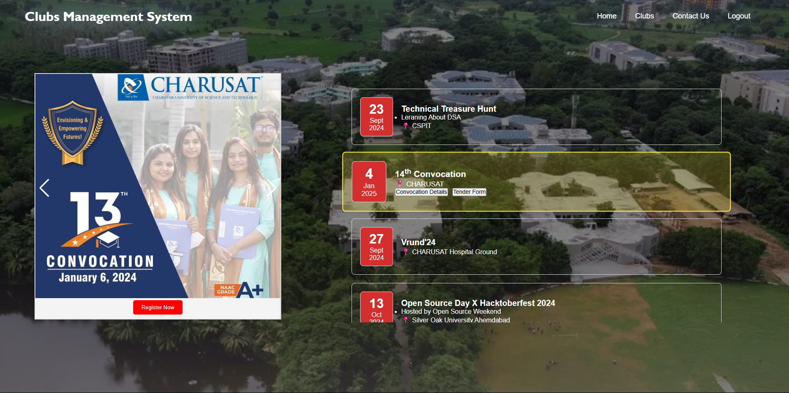
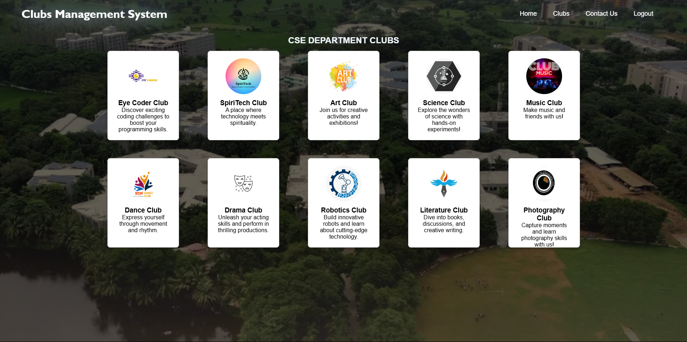
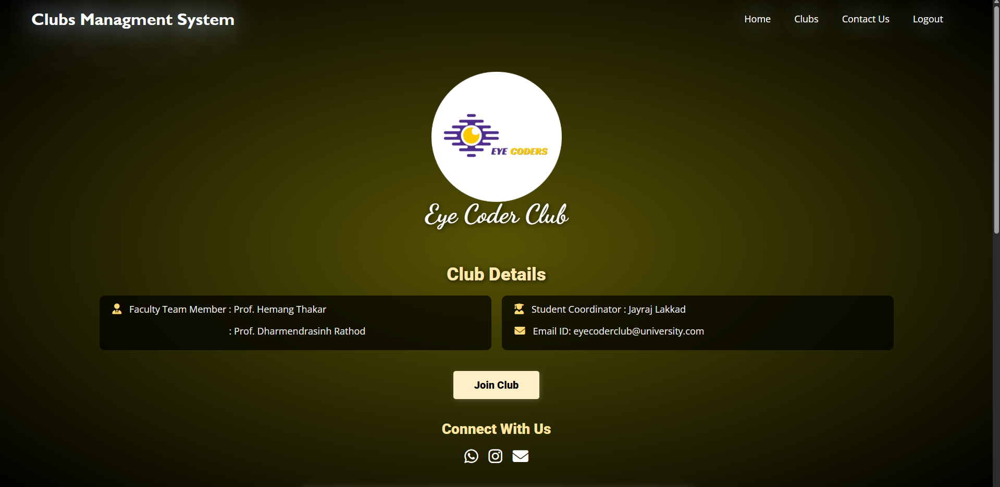
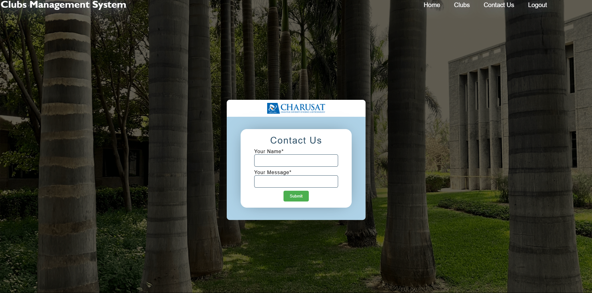

# Club Management System

## Project Overview
The Club Management System is a web-based application designed to manage university clubs and activities. The system allows users to browse different clubs, view club details, contact administrators, and participate in club events.

## Application Screenshots

### Homepage


### Clubs Listing


### Club Details


### Contact Page


## Features
- **User Authentication**: Secure login and signup functionality
- **Club Directory**: Browse through various clubs with detailed information
- **Club Pages**: Individual pages for each club with specific details
- **Contact Form**: Ability to send feedback or inquiries
- **Responsive Design**: Works on desktop and mobile devices

## Database Structure

### Users Table
This table stores user authentication information.

| Field     | Type         | Null | Key | Default | Extra          |
|-----------|--------------|------|-----|---------|----------------|
| id        | int(11)      | NO   | PRI | NULL    | AUTO_INCREMENT |
| email     | varchar(255) | NO   |     | NULL    |                |
| password  | varchar(255) | NO   |     | NULL    |                |


### Feedback Table
This table stores messages submitted through the contact form.

| Field        | Type         | Null | Key | Default           | Extra          |
|--------------|--------------|------|-----|-------------------|----------------|
| id           | int(11)      | NO   | PRI | NULL              | AUTO_INCREMENT |
| name         | varchar(255) | NO   |     | NULL              |                |
| email        | varchar(255) | NO   |     | NULL              |                |
| message      | text         | NO   |     | NULL              |                |
| submitted_at | timestamp    | NO   |     | current_timestamp |                |


## Project Structure
```
club_management/
├── api/
│   ├── contact.php          # Handles contact form submissions
│   └── db_check.php         # Utility for checking database tables
├── assets/
│   ├── css/                 # Stylesheet files
│   ├── js/                  # JavaScript files
│   └── images/              # Image files
├── auth/
│   ├── login.html           # Login page
│   ├── login.php            # Login processing
│   ├── signup.html          # Signup page
│   ├── signup.php           # Signup processing
│   └── logout.php           # Logout functionality
├── Clubs/                   # Note: Case-sensitive directory name
│   ├── art-club/
│   ├── dance-club/
│   ├── drama-club/
│   ├── eye-coder/
│   ├── literature-club/
│   ├── music-club/
│   ├── photography-club/
│   ├── robotics-club/
│   ├── science-club/
│   └── SpiriTech/           # Note: Case-sensitive directory name
├── includes/
│   └── db_connect.php       # Database connection file
├── clubs.html               # Club listing page
├── contact.html             # Contact page
├── index.html               # Homepage
└── README.md                # Project documentation
```

## Installation and Setup

### Prerequisites
- Web server (Apache/Nginx)
- PHP 7.0 or higher
- MySQL/MariaDB
- XAMPP (recommended for local development)

### Database Setup with XAMPP
1. **Install XAMPP**: Download and install from [https://www.apachefriends.org](https://www.apachefriends.org)

2. **Start XAMPP Services**:
   - Launch XAMPP Control Panel
   - Start Apache and MySQL services

3. **Create Database**:
   - Open phpMyAdmin by navigating to [http://localhost/phpmyadmin](http://localhost/phpmyadmin)
   - Create a new database named `clubs_management`

4. **Configure Database Connection**:
   - Open the file `includes/db_connect.php`
   - Verify that the connection settings match your environment:
     ```php
     $servername = "localhost";
     $username = "root";  // Default XAMPP MySQL user
     $password = "";      // Default XAMPP MySQL password is empty
     $dbname = "clubs_management";
     ```

5. **Create Required Tables**:
   - Navigate to [http://localhost/club_management/api/db_check.php](http://localhost/club_management/api/db_check.php) to automatically create the Feedback table
   - Or manually create the tables using the following SQL:

     ```sql
     -- Users Table
     CREATE TABLE users (
         id INT(11) NOT NULL AUTO_INCREMENT PRIMARY KEY,
         email VARCHAR(255) NOT NULL,
         password VARCHAR(255) NOT NULL
     );

     -- Feedback Table
     CREATE TABLE Feedback (
         id INT(11) NOT NULL AUTO_INCREMENT PRIMARY KEY,
         name VARCHAR(255) NOT NULL,
         email VARCHAR(255) NOT NULL,
         message TEXT NOT NULL,
         submitted_at TIMESTAMP DEFAULT CURRENT_TIMESTAMP
     );
     ```

### Important Notes
1. **Case Sensitivity**: The directory and table names are case-sensitive. Ensure that:
   - The `Clubs` directory is capitalized
   - The `Feedback` table is capitalized
   - The `SpiriTech` club directory has capital 'S' and 'T'

2. **File Permissions**: Ensure proper read/write permissions for:
   - All PHP files
   - The includes directory
   - The api directory

## Usage

1. **Accessing the System**:
   - Open your web browser and navigate to [http://localhost/club_management](http://localhost/club_management/auth/login.html)

2. **User Registration**:
   - Click on the Login link
   - Select "Sign up" to create a new account
   - Enter your email and password

3. **Browsing Clubs**:
   - After logging in, navigate to the Clubs page
   - Click on any club to view detailed information

4. **Contacting Administrators**:
   - Navigate to the Contact Us page
   - Fill out the form with your name and message
   - Click Submit to send your feedback

## Troubleshooting

1. **404 Not Found Errors**:
   - Check for case sensitivity in directory and file names
   - Verify that all files exist in the correct locations
   - Ensure XAMPP is properly configured

2. **Database Connection Issues**:
   - Verify database credentials in `includes/db_connect.php`
   - Ensure MySQL service is running
   - Check if the database and tables exist

3. **Form Submission Errors**:
   - Check session management for login requirements
   - Verify form action URLs point to the correct paths
   - Inspect browser console for JavaScript errors

## Security Considerations
1. Passwords are hashed using PHP's `password_hash()` function
2. Prepared statements are used to prevent SQL injection
3. Session management is implemented for user authentication

## Future Enhancements
1. Admin panel for club management
2. Event calendar integration
3. Member registration for individual clubs
4. Image uploads for club profiles
5. Email notifications for events

## Credits
Developed as a club management solution for university students to easily discover and engage with various campus clubs and activities.

### Contributors
- Harsh Pipaliya
- Mitanshu Sailor 
